# 🌤️ **Flutter Weather App – [Nguyễn Chung Hiếu]**
# demo https://drive.google.com/file/d/16C8LujS-z_hoETlzOKmlVzJtSHo1Y46b/view?usp=sharing

Ứng dụng dự báo thời tiết đa nền tảng (Android/iOS) được xây dựng bằng **Flutter**, hỗ trợ **hiển thị thời tiết theo vị trí**, **tìm kiếm thành phố**, **bản đồ thời tiết Windy-style**, **chỉ số chất lượng không khí**, **cảnh báo thời tiết**, **đa ngôn ngữ (EN/VN)**, **offline cache**, và thiết kế UI hiện đại.

---

# 📱 **Tính năng chính**

## 🌦️ 1. *Thời tiết hiện tại*

* Nhiệt độ, trạng thái thời tiết, độ ẩm, gió, áp suất
* **Hướng gió (Wind Direction) – đã thêm**
* **Sunrise & Sunset – đã thêm**
* Icon động theo điều kiện thời tiết

---

## 📅 2. *Dự báo thời tiết*

* 24 giờ tiếp theo
* 7 ngày tiếp theo
* UI dạng thẻ hiện đại
* Có shimmer loading khi đang tải

---

## 🌍 3. *Weather Maps (Windy-style nâng cao)*

**Tính năng nổi bật nhất của app**
Bao gồm hiệu ứng Overlay tự vẽ bằng `CustomPainter`:

### ✔️ Cloud Coverage Layer

### ✔️ Temperature Layer

### ✔️ Precipitation Layer

### ✔️ Hiệu ứng gió động (Wind Particles) → giống Windy

### ✔️ Hiệu ứng mưa động

### ✔️ Hiệu ứng nhiệt độ (Temp Glow Overlay)

### ✔️ Kéo/zoom 2 ngón đầy đủ

### ✔️ Nút quay về vị trí hiện tại (MyLocation)

### ✔️ Panel điều khiển có thể thu nhỏ/mở rộng

---

## 🔎 4. *Tìm kiếm thành phố*

* Tự động lưu lịch sử tìm kiếm
* Gợi ý khi nhập

---

## 📍 5. *Lấy vị trí hiện tại*

* Gọi LocationService → lấy GPS
* Refresh location
* Nút “Quay về vị trí của tôi” trong Weather Maps

---

## 🌫️ 6. *Air Quality Index (AQI)*

* Chỉ số AQI theo chuẩn quốc tế
* PM2.5, PM10, O₃, CO, NO₂, SO₂
* Icon tình trạng sức khỏe

---

## 🚨 7. *Cảnh báo thời tiết (Alerts)*

* Gió mạnh, bão, lũ
* Hiển thị theo API OWM OneCall

---

## 📶 8. *Offline mode*

* Lưu cache thời tiết
* Cho phép hiển thị lại khi mất mạng
* Hiển thị “Updated x minutes ago”

---

## 🌐 9. *Đa ngôn ngữ (EN – VI)*

* File: `/lib/l10n/`
* Tự đổi ngôn ngữ trong Settings

---

## 🧭 10. *Giao diện đẹp – Material 3*

* Hiện đại, nhẹ
* Có Animation cho từng màn hình
* Weather Maps cực mượt

---

# 📂 **Cấu trúc dự án (theo đúng project của bạn)**

```
lib/
│
├── config/
│   └── api_config.dart
│
├── l10n/
│   ├── app_en.arb
│   ├── app_vi.arb
│   ├── app_localizations.dart
│   ├── app_localizations_en.dart
│   └── app_localizations_vi.dart
│
├── models/
│   ├── weather_model.dart
│   ├── forecast_model.dart
│   ├── hourly_weather_model.dart
│   ├── air_quality_model.dart
│   ├── weather_alert_model.dart
│   ├── location_model.dart
│   └── ...
│
├── providers/
│   ├── weather_provider.dart
│   ├── location_provider.dart
│   ├── settings_provider.dart
│   └── locale_provider.dart
│
├── screens/
│   ├── home_screen.dart
│   ├── search_screen.dart
│   ├── forecast_screen.dart
│   ├── air_quality_screen.dart
│   ├── alerts_screen.dart
│   ├── settings_screen.dart
│   ├── compare_cities_screen.dart
│   └── weather_maps_screen.dart   ← WINDY-style feature
│
├── services/
│   ├── weather_service.dart
│   ├── weather_backup_service.dart
│   ├── location_service.dart
│   ├── storage_service.dart
│   ├── air_quality_service.dart
│   ├── connectivity_service.dart
│   ├── settings_service.dart
│   └── ...
│
├── utils/
│   ├── constants.dart
│   ├── date_formatter.dart
│   ├── weather_icons.dart
│   └── weather_translator.dart
│
├── widgets/
│   ├── current_weather_card.dart
│   ├── hourly_forecast_list.dart
│   ├── daily_forecast_card.dart
│   ├── weather_detail_item.dart
│   ├── loading_shimmer.dart
│   └── error_widget.dart
│
└── main.dart
```

---

# 🔑 **Hướng dẫn cấu hình API (.env)**

Tạo file **`.env`** ở root:

```
OPENWEATHER_API_KEY=your_key_here
WEATHER_API_KEY=your_backup_api_key
```

---

# ▶️ **Cách chạy dự án**

## 1. Cài đặt Flutter

```
flutter --version
```

## 2. Cài packages

```
flutter pub get
```

## 3. Chạy app

```
flutter run
```


# 📸 **Ảnh chụp màn hình (Full chức năng)**

> ⚠️ Gợi ý: Tạo thư mục `screenshots/` trong GitHub và upload ảnh thật.
> Mình đặt tên file để bạn chỉ việc thay bằng ảnh của app.

---

## 🏠 **1. Màn hình chính – Current Weather**

* Nhiệt độ hiện tại
* Mô tả thời tiết
* Hướng gió & tốc độ gió
* Sunrise / Sunset
* AQI mini-card
* Weekly Forecast


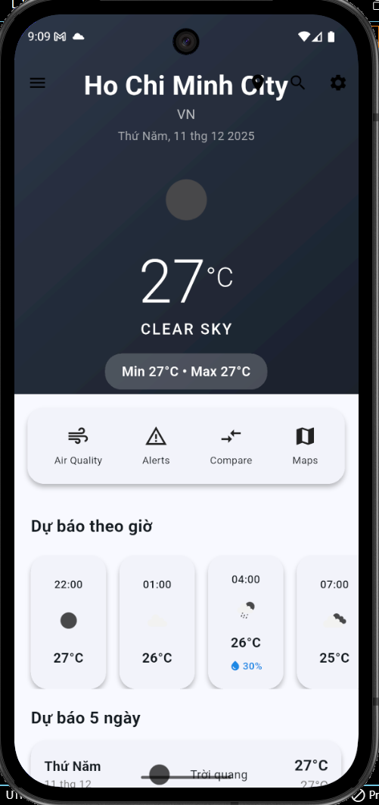


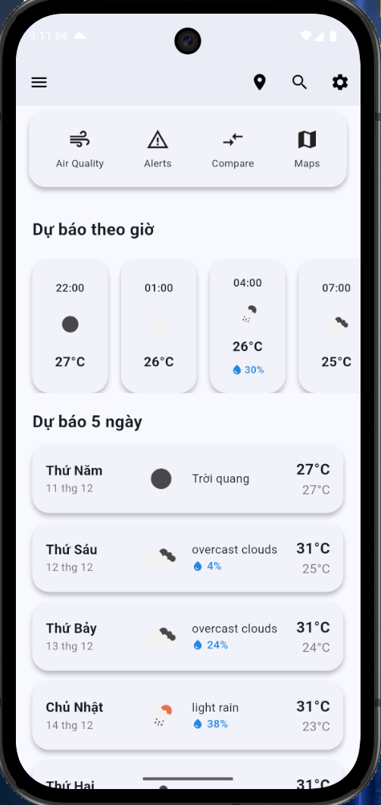

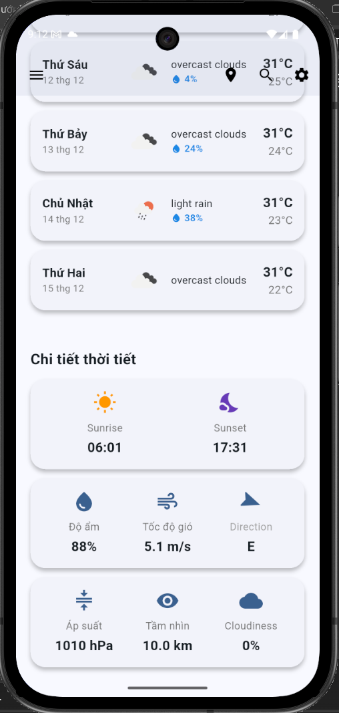


## 🕒 **2. Dự báo theo giờ (Hourly Forecast)**

* Nhiệt độ
* Icon thời tiết
* Xoay theo timeline


## 📅 **3. Dự báo 7 ngày (Daily Forecast)**

* Min/Max temperature
* Icon dự báo


## 🔍 **4. Tìm kiếm thành phố**

* Realtime search
* Lưu lịch sử gần đây

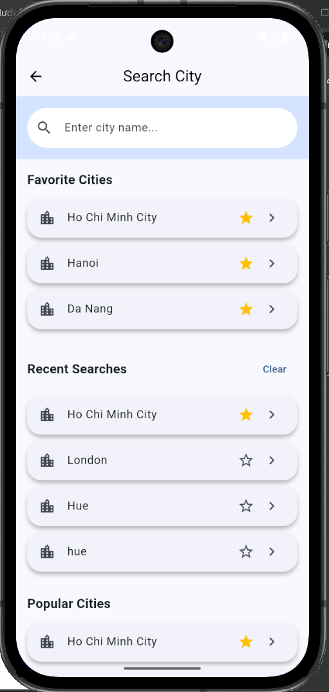

## 🌍 **5. Weather Maps (Windy-Style)**

### ✔ Radar (Clouds Layer)

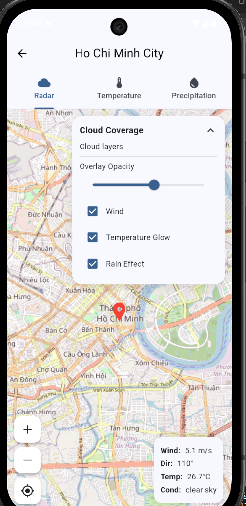

### ✔ Temperature Layer (+ hiệu ứng Temp Glow)

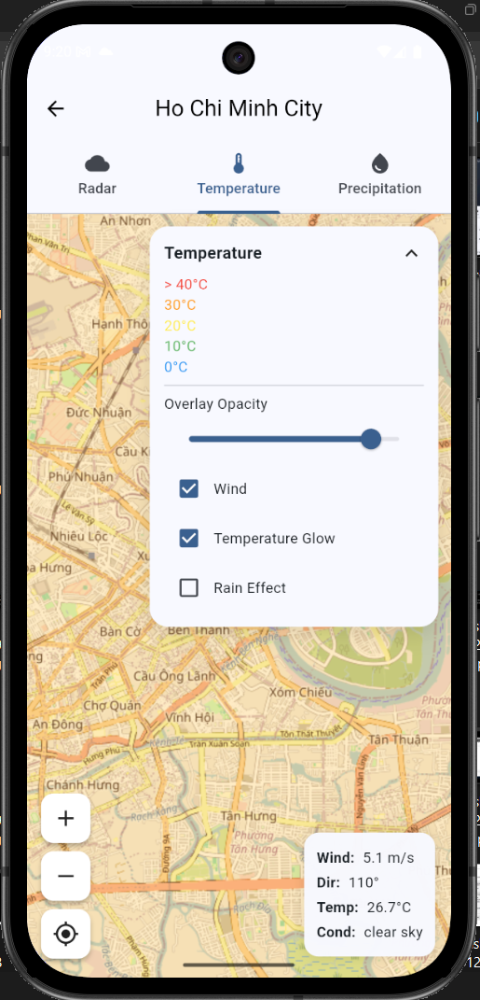

### ✔ Precipitation Layer

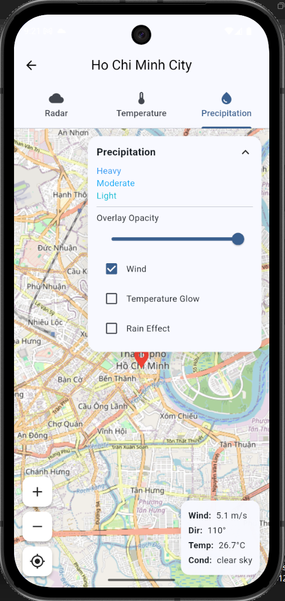

### ✔ Nút quay lại vị trí của tôi


### ✔ Panel điều khiển có thể thu gọn

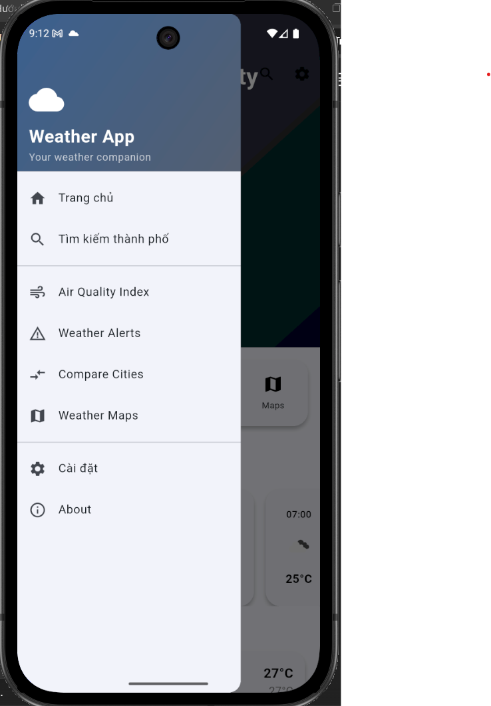


## 🌫️ **6. Chỉ số chất lượng không khí (AQI)**

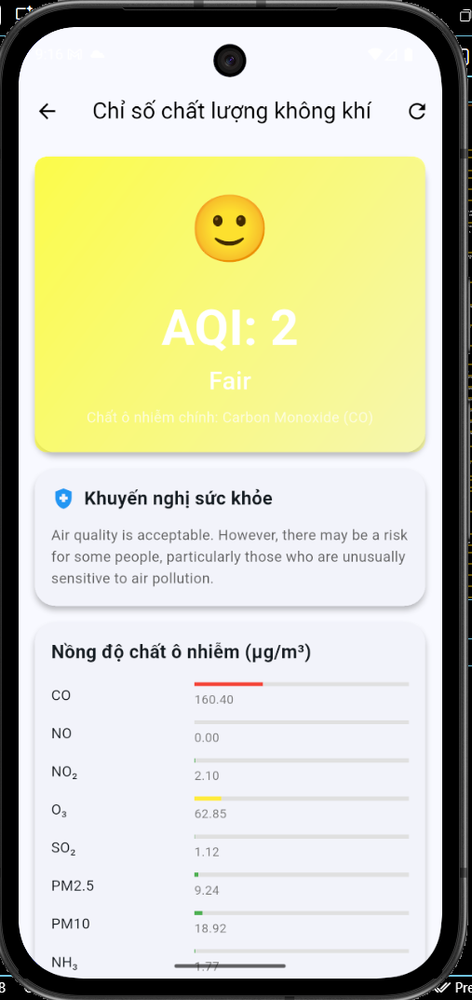


## 🚨 **7. Cảnh báo thời tiết (Weather Alerts)**

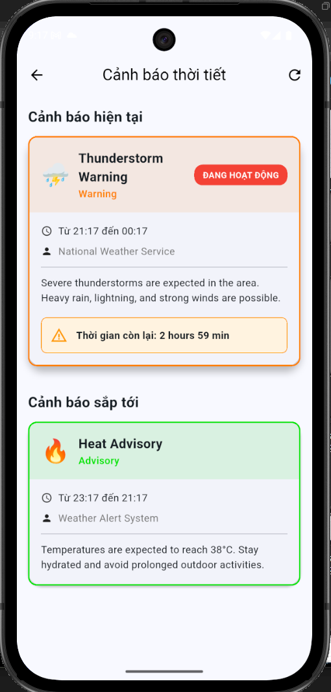


## 🌐 **8. Đa ngôn ngữ (EN – VI)**

### English Mode:

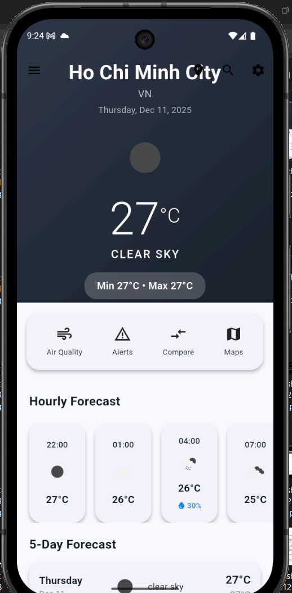


### Vietnamese Mode:

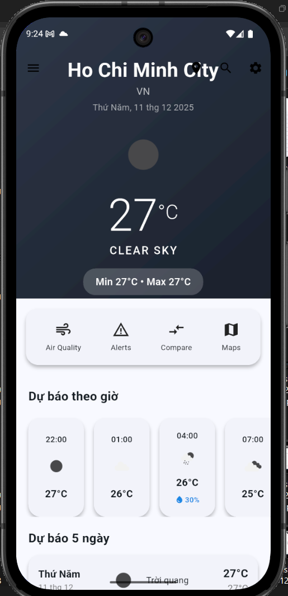


## ⚙️ **9. Settings**

* Đổi ngôn ngữ
* Đổi đơn vị nhiệt độ
* Xóa cache


# 🧭 **10. So sánh thành phố**

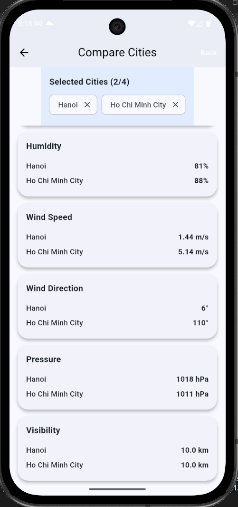


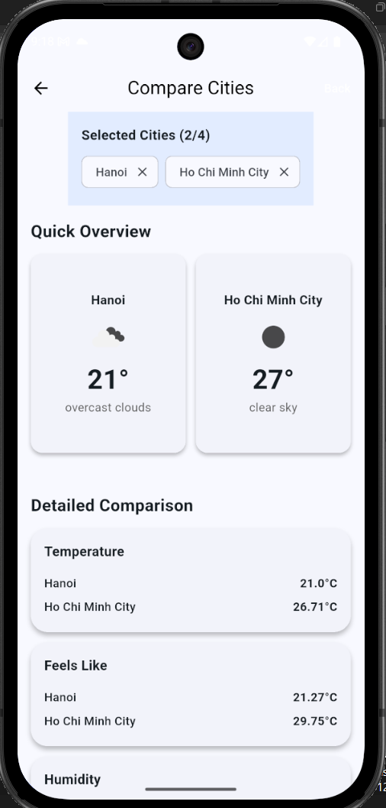

# 🧭 **11. widgets **

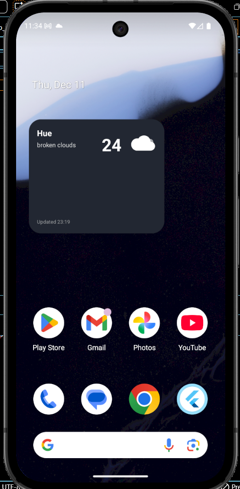

# 🛠 **Công nghệ sử dụng**

* Flutter (Material 3)
* Provider (State Management)
* Flutter Map 6.2.x
* CustomPainter (Wind + Rain + Temp Effects)
* REST API – OpenWeatherMap
* Localization (ARB + intl)
* SharedPreferences (Cache offline)
* Geolocator (Lấy vị trí)
* HomeWidget (Android widget)

---

# 🧩 **Hạn chế (Known Limitations)**

* Wind animation dùng CustomPainter → tốn CPU trên máy yếu
* Map tile phụ thuộc tốc độ mạng
* Offline mode chỉ hiển thị dữ liệu đã lưu
* Cảnh báo thời tiết phụ thuộc API OneCall 3.0

---

# 🚀 **Hướng cải tiến tương lai**

* Thêm Dark Theme
* Thêm chế độ Radar Animation (lặp tile theo thời gian)
* Thêm hiệu ứng tuyết
* Hỗ trợ iOS Home Widget
* Tối ưu particle engine bằng compute isolate


